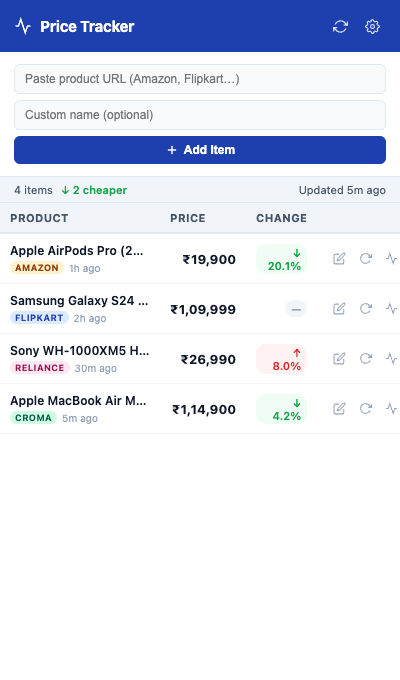
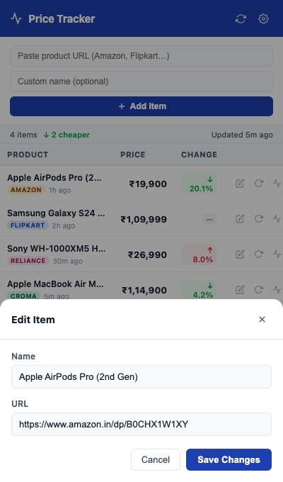
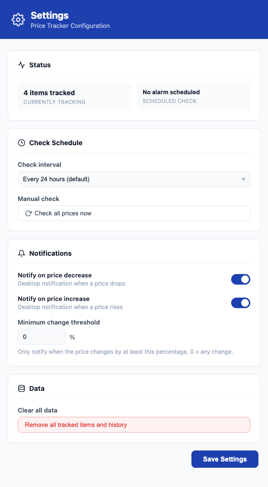

# Price Tracker

A Chrome extension that tracks product prices from Amazon, Flipkart, Reliance Digital, Croma and more — right in your browser sidebar. Get desktop notifications whenever a price drops or rises, with full price history and zero backend required.

## Screenshots

<table>
  <tr>
    <td align="center"><b>Sidebar — live price table</b></td>
    <td align="center"><b>Edit item name & URL</b></td>
  </tr>
  <tr>
    <td></td>
    <td></td>
  </tr>
</table>

<details>
<summary>Settings page</summary>
<br/>

</details>

---

## Features

- **Multi-site support** — Amazon India, Flipkart, Reliance Digital, Croma, Myntra, Meesho, and any site with JSON-LD / Open Graph price metadata
- **Chrome Side Panel** — always-visible sidebar showing live last-fetched prices without leaving your tab
- **Desktop notifications** — instant alerts when a price increases or decreases, with a direct "View Product" button
- **Price history** — per-item history log (up to 60 entries) accessible in one click
- **Edit entries** — rename any item or update its URL without re-adding it
- **Scheduled checks** — configurable interval from 1 hour to 2 days using `chrome.alarms` (runs even when the sidebar is closed)
- **Manual refresh** — refresh a single item or all items on demand
- **No backend** — 100% client-side; data lives in `chrome.storage.local`
- **Tabular design** — compact table with site badges, price change %, and colour-coded indicators

---

## Installation

> **Requires Chrome 114+** (Side Panel API)

1. Go to the [**Releases page**](https://github.com/AviroopPaul/price-tracker/releases/latest) and download **`price-tracker-vX.X.X.zip`**

2. Unzip the downloaded file

3. Open **`chrome://extensions`** in Chrome

4. Enable **Developer mode** (toggle in the top-right corner)

5. Click **Load unpacked** and select the unzipped folder

6. Click the **Price Tracker icon** in your toolbar — the side panel opens

---

## Usage

### Adding an item
Paste any product URL into the input field. Optionally enter a custom name. Hit **Add Item** — the extension fetches the current price immediately.

### Editing an item
Click the **pencil icon** on any row to edit the product name or URL inline via the edit modal.

### Price history
Click the **waveform icon** on any row to view the full price history log for that product.

### Notifications
When a scheduled or manual check detects a price change that meets your threshold, a desktop notification fires automatically. Click **View Product** in the notification to open the product page directly.

---

## Settings

Open the settings page via the **gear icon** in the sidebar header (opens in a new tab).

| Setting | Description | Default |
|---|---|---|
| Check interval | How often all items are checked automatically | 24 hours |
| Notify on decrease | Send notification when price drops | On |
| Notify on increase | Send notification when price rises | On |
| Minimum threshold | Only notify if price changes by at least X% | 0% |

---

## Supported Sites

| Site | Detection |
|---|---|
| Amazon India | Site-specific selectors + JSON fallback |
| Flipkart | Site-specific selectors |
| Reliance Digital | Site-specific selectors |
| Croma | Site-specific selectors |
| Myntra | Generic fallback |
| Meesho | JSON field extraction |
| Any other site | JSON-LD schema.org, Open Graph meta tags, ₹ symbol heuristic |

> **Note:** Amazon has strong bot-detection. Price fetches may occasionally fail — the extension will silently retry on the next scheduled check.

---

## How it works

```
chrome.alarms (scheduled)
       │
       ▼
background.js (service worker)
  ├── fetch(url)          ← cross-origin via host_permissions
  ├── regex price extract ← works without DOMParser in service workers
  ├── chrome.storage.local.set(items)
  └── chrome.notifications.create()
               │
               ▼
  sidebar.js listens via chrome.storage.onChanged
  → re-renders table instantly, no polling needed
```

---

## Project structure

```
price-tracker/
├── extension/
│   ├── manifest.json       # MV3 manifest
│   ├── background.js       # Service worker: alarms, fetch, notifications
│   ├── sidebar.html/css/js # Chrome Side Panel UI
│   ├── settings.html/css/js
│   └── icons/
└── screenshots/
```

---

## License

MIT
